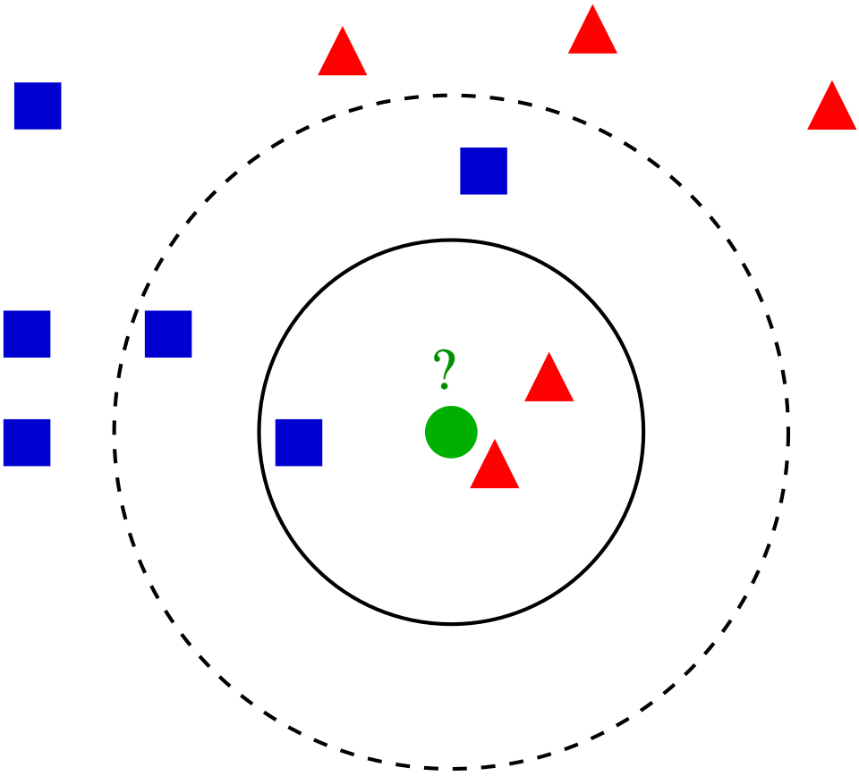
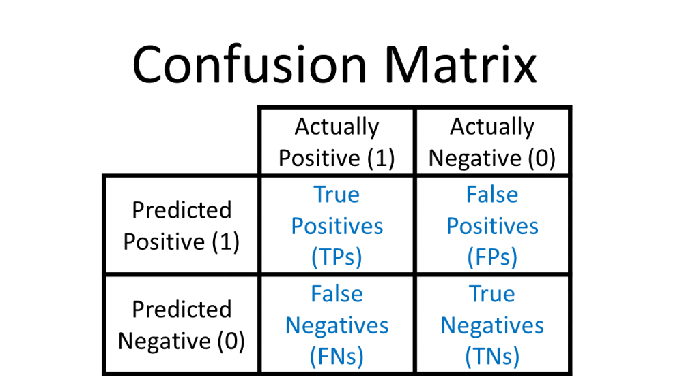

------

[Presentation](link){.external target="_blank"}
 
# Introduction

When give data we typically want to make sense of what the data is telling us. Machine learning algorithms enable us to do just that. They are mathematical and statistical instructions that computers learn to make sense of a raw dataset. 

One such learning algorithm that we will look at is K-Nearest Neighbor. It is considered a "non-parametric supervised learning algorithm." Non-parametric meaning it makes few or no assumptions about the underlying shape or distribution of data. Supervised, as in, it learns from labeled data (input that has a corresponding output) with a goal to predict outcomes for new, unseen data.  

The main goal of the K-Nearest Neighbors(KNN) algorithm is to predict the classification or numerical value of a new data point based on how similar it is to its closest neighbors. In this paper we will discuss the concept and underlying methodology of KNN, it's strengths and limitations, as well as its real-world applications such as in business and medicine. Specifically, applying the KNN algorithm to identify diabetes within a group of subjects who were studied in order to understand the prevalence of obesity, diabetes, and other cardiovascular risk factors. 

You can think of KNN as "birds of a feather flock together." 


# Method
The K-Nearest Neighbors (KNN) algorithm is one of the simplest and most intuitive supervised machine learning methods used for both classification (assigning a category) and regression (predicting a value). It is a non-parametric, supervised machine learning method used for both classification and regression. It requires two instances for it to achieve its goal 1) a distance metric and 2) defining K. Its methodology relies on the proximity principle, assuming that similar data points exist in close proximity within a feature space. 

Take a look at the following photo. 

<center>
{#fig-1}
</center>

But KNN is a bit more complex than simply pictured. Core Steps of the KNN Methodology include: 

1. Defining the Parameter 'K': When defining or selecting k, we are selecting the number of nearest neighbors to consider. In other words, the k defines how many neighbors will be checked to determine the classification of a query point. For example, K=1, means it will be assigned to the same class as its single nearest neighbor. Choosing K depends on the input data. For example, data with more outliers performs much better with higher k values. We also want to choose an odd number for k to minimize the chances of ties in classification. 

2. Calculating Distance: When a new, unlabeled data point is introduced, the algorithm calculates its distance to every other point in the training dataset. The distance metric measures the distance between the query point(s) and other data points. It can be calculated using either Euclidean distance, Manhattan distance, Minkowski, or Hamming distance, and we can visualize this using Voronezh diagrams like above.

- Euclidean Distance: Most commonly used. Measures the "straight-line" path between points; best for continuous data.
_Euclidean distance_:
 
$$
D_{euclidean}(x_1, x_2) = \sqrt{\sum_{i = 1}^{n}{((x_1)_i - (x_2)_i)^2}}
$$

- Manhattan Distance: Calculates the sum of absolute differences, similar to navigating a grid (taxicab geometry).
_Manhattan distance_:

$$
D_{manhattan}(x_1, x_2) = \sum_{i = 1}^{n}|((x_1)_i - (x_2)_i)|
$$
- Minkowski Distance: A generalized formula that can represent both Euclidean (p=1) and Manhattan (p=2) distances.
$$
D_{Minkowski}(X,Y) = \sum_{i = 1}^{n}|x_i - y_i|^p
$$
- Hamming Distance: Used for categorical or string variables to identify where vectors do not match.
<center>
![Hamming Distance XOR (Image Source: ©Anand. Inspired from [@yul2020astudy])](Hamming Distance.png){#fig-2}
</center>

3. Identify Neighbors: Combining steps 1 and 2. We sort the calculated distances based on our metric distance formula and select the points with the smallest distance values to the new query point. 

4. Aggregate results based on the goal. 

 - Classification: The new point is assigned the class that appears most frequently among its k 
 neighbors (majority or plurality voting).
 
 - Regression: The algorithm predicts a continuous value by taking the average (mean) or median of the k
 neighbors' target values. 

Key Characteristics of KNN

Lazy Learning: KNN is considered a "lazy learner" because it does not have a distinct training phase. It simply stores the training data and defers all computation until a prediction is requested.

Non-Parametric: It makes no prior assumptions about the underlying distribution of the data, making it flexible for complex datasets.

Sensitivity to Scale: Because it relies on distance, features with larger magnitudes can disproportionately influence results. Therefore, feature scaling (standardization or normalization) is a critical preprocessing step. 

Finding the Optimal 'K': The value of k is often determined using the Elbow Method or Cross-Validation, where multiple k values are tested to find the one that minimizes the error rate without overfitting or underfitting. Analysts typically choose an odd number for k to prevent ties in classification. In our example, we will be using cross-validation to determine the value of 'k'. In cross validation, the dataset is divided by kfolds. Where at each iteration each fold is used once as test data and the remaining fold is used as training data, the process is repeated until all data is evaluated.[https://www.ijadis.net/index.php/ijadis/article/view/k-nearest-neighbor-with-k-fold-cross-validation-and-analytic-hie/18]

Strengths of KNN 

1.Easy to implement/learn. There are also few hyper parameters - just the distance and k value. 

2. It's also adaptable. It adjusts easily to new training data since all training data is stored into memory. But similarly, because of that, it doesn't scale well. As the data set grows, the algorithm becomes less efficient due to increasing computational complexity, which compromises overall model performance.

Weaknesses of KNN 

1. As mentioned, it can be considered a "lazy algorithm" meaning it stores all training data and defers the computation to the time of classification, increasing memory usage and leads to slower processing compared to other methods of classifying. In other words, it does not build the model beforehand. It instead stores the data and makes predictions on demand. 

2. KNN also has what's called the "Curse of Dimensionality." It does not perform well with high dimensional data inputs. On a 2D xy graph it works fine but if we wanted to classify according to color, size, weight, etc. then the data points become sparse in higher dimensions and the distance between points become too similar for KNN to find meaningful neighbors. This leads to what's called the "peaking phenomenon." The peaking phenomenon occurs after reaching the optimal number of features - any more just increases noise and increases classification errors especially when the sample size is small. Feature selection and dimensionality reduction techniques can help minimize "curse of dimensionality" but we need to be careful. 

3. Another weakness is overfitting. Low k values can overfit  the data. High values tend to smooth out prediction values since average values over a greater are or neighborhood. 

Uses of the KNN Algorithm

When it comes to uses, we can use the KNN algorithm for simple recommendation systems. Data free processing is most commonly used because it's helpful for data sets with missing values because it estimates values using process called missing data imputation. KNN is actually most often used in finance like stock market forecasting, currency exchange rate, money laundering analysis. But it is also used in health care. For example, risk of heart attacks and prostate cancer by calculating most likely gene expression. In this paper we will apply the KNN algorithm to a data set of potential diabetic patients.  

# Analysis and Results
## Data Description
These data sets are courtesy of Dr John Schorling, Department of Medicine, University of Virginia School of Medicine.
The data consist of 19 variables on 403 subjects from 1046 subjects who were interviewed in a study to understand the prevalence of obesity, diabetes, and other cardiovascular risk factors in central Virginia for African Americans. According to Dr John Hong, Diabetes Mellitus Type II (adult onset diabetes) is associated most strongly with obesity. The waist/hip ratio may be a predictor in diabetes and heart disease. DM II is also associated with hypertension - they may both be part of "Syndrome X". The 403 subjects were the ones who were actually screened for diabetes. Glycosolated hemoglobin > 7.0 is usually taken as a positive diagnosis of diabetes. 
```{r, echo=FALSE}

```

```{r, include=FALSE}
library(mt)
library(caret)
library(httr)
library(readxl)
library(dplyr)
library(knitr)
GET("https://query.data.world/s/qmc5py3qjodoyglqcny7ihdowxwepf?dws=00000", write_disk(tf <- tempfile(fileext = ".xlsx")))
df <- data.frame(read_excel(tf))
```
```{r, echo=TRUE}
kable(head(df))
```

As shown, we have variables we do not need/want including empty columns. We'll select the non-demographic columns to begin and create a reduced data set. The new table below shows the first 6 rows of our reduced data set. 
```{r, echo=TRUE}
df_reduced <- df[c("Diabetes", "Cholesterol", "Glucose", "BMI", "Waist.hip.ratio", "HDL.Chol", "Chol.HDL.ratio", "Systolic.BP", "Diastolic.BP", "Weight")]
kable(head(df_reduced))
```

The table below now shows a description of each of our variables to be used. 
```{r, include=FALSE}
vars <- data.frame(
  Variables = c("Diabetes", "Cholesterol", "Glucose", "BMI", "Waist.hip.ratio", "HDL.Chol", "Chol.HDL.ratio", "Systolic.BP", "Diastolic.BP", "Weight"),
  Description = c("Yes/No", "Numeric", "Numeric", "Numeric", "Waist to Hip Ratio","Numeric","Cholesterol to HDL ratio","Systolic Blood Pressure","Diastolic Blood Pressure","Numeric")
  
)
```
```{r, echo=TRUE}
kable(vars)
```
## Cleaning the data
Like mentioned, kNN is sensitive to scaling (of the variables). So it is helpful to first standardize the variables. We do this using the preProcess function of the caret package:

```{r, echo=TRUE}
preproc_reduced <- preProcess(df_reduced[,2:10], method = c("scale", "center"))
df_standardized <- predict(preproc_reduced, df_reduced[, 2:10])
```

Now we have scaled and centered values for our data.frame:
```{r, echo=TRUE}
summary(df_standardized)
```
Apply those scaled and centered values to our data using the bind_cols method from dpylr to normalize all of our data.
```{r, echo=TRUE}
df_stdize <- bind_cols(Diabetes = df_reduced$Diabetes, df_standardized)
```
Now we have a data set which will work well for KNN! 

## Using the KNN Model 
First, we create a test/train split so that we can train a KNN model. 
We will use the createDataPartition from caret to randomly select 80% of the data to use for the training set and 20% of the data to use for the test set. Then, create two different data frames using partition point returned by createDataPartition.

```{r, echo=TRUE}
set.seed(42)
# "p" indicates how much of the data should go into the first created partition
param_split<- createDataPartition(df_stdize$Diabetes, times = 1, p = 0.8, list = FALSE)
train_df <- df_stdize[param_split, ]
test_df <- df_stdize[-param_split, ]
```
Now we train the KNN. 

The trainControl method is a helper function for all the nuances of the KNN train method. It allows you to easily set up the KNN training parameters.

```{r,echo=TRUE}
trnctrl_df <- trainControl(method = "cv", number = 10)
```
method: This is the resampling method used. Using "cv" or cross validation. 
number: The number of folds because we're using cv. 

Now we will use all variables to predict Diabetes. 
Then specify the training data, that we're training a KNN, and pass the training hyperparameters that we built with trainControl.

```{r, echo=TRUE}
model_knn_df <- train(Diabetes ~ ., data = train_df, method = "knn", 
                      trControl = trnctrl_df, 
                      tuneLength = 10)

model_knn_df
```
This returns a series of KNN models and their associated metrics and tells us that the optimal number of nearest neighbors to be considered is 11 and the model accuracy for that K is 0.9198387. 
That's good but the Kappa score is 0.6138024, which can indicate that our model is not predicting the two classes with an even accuracy.
Because our data is imbalanced, which is common in the real-world, one class is much more frequent than the others.In these cases, overall accuracy becomes misleading because a model can be highly accurate simply by predicting the majority class.
How Cohen’s kappa value helps is that it adjusts the agreement that could occur simply due to the majority class, providing a more realistic estimate of the model’s performance.

Remember that most of the records in our data set are not patients with diabetes.Our model might simply guess that no patients have diabetes and achieve fairly high accuracy that way.[https://www.knime.com/blog/cohens-kappa-an-overview#:~:text=%231.-,When%20your%20data%20is%20imbalanced,estimate%20of%20the%20model's%20performance.]

## Second KNN Model to predict Diabetes based on "Glucose" 

We can find that simpler models have better accuracy. To see which variables are having the most impact on our outcome variable, we can use fs.anova to check the analysis of variance for each variable and use that in a second KNN.
```{r,echo=TRUE}
df_stdize$Diabetes = ifelse(df_stdize$Diabetes == "Diabetes", 1, 0)
fs <- fs.anova(df_stdize, df_stdize$Diabetes)
print(fs$fs.order)
```
As we already guessed, we can now confirm that "Glucose" is the most important feature in our data set for predicting diabetes.

We can now do two things here to improve our performance. First, we'll balance our data set so that we have equal numbers of records with and without diabetes. 
```{r, echo=TRUE}
positive_cases <- nrow(train_df[train_df$Diabetes == 'Diabetes',])

balanced = rbind(train_df[sample(which(train_df$Diabetes == 'No diabetes'), positive_cases),], train_df[train_df$Diabetes == 'Diabetes',])
```

Second, we'll use just the Glucose readings to calculate the distance to our 'neighbors' in KNN. 
```{r, echo=TRUE}
trnctrl_df <- trainControl(method = "cv", number = 10)
model_knn_df_simple <- train(Diabetes ~ Glucose, data = balanced, method = "knn", 
                             trControl = trnctrl_df, 
                             tuneLength = 10)

model_knn_df_simple
```
The simpler model seems to have better performance. With a K value of 15, we see an accuracy of 0.93 and a Kappa of 0.86. 
Both of these scores are higher than we had seen with the larger model and the Kappa of 0.86 indicates that we are predicting both classes better although still not perfectly.

## Evaluating both KNN Models

Since we held out a testing set of 20% of our training data, we have an easy way to evaluate both of our models. We will pass the model to predict and check the results against the actual test labels. Use a confusion matrix to assess how well our model predicts the test data. To recap, a confusion matrix looks like this: 
<center>
{#fig-3}
</center>

```{r,echo=TRUE}
predict_knn <- predict(model_knn_df, test_df)
confusionMatrix(as.factor(predict_knn), as.factor(test_df$Diabetes), positive = "Diabetes")
```
Our "everything model" or unbalanced model does a good job of identifying patients without diabetes but a poor job of identifying patients with diabetes. The model only accurately identifies 25% of the records labeled 'Diabetes'.

Now we will look at the confusion matrix for our balanced model. 
```{r, echo=TRUE}
predict_knn_simple <- predict(model_knn_df_simple, test_df)
confusionMatrix(as.factor(predict_knn_simple), as.factor(test_df$Diabetes), positive = "Diabetes")
```
As we can see, our overall accuracy rate has fallen slightly, but our ability to predict the diabetes label is much much better. This model correctly predicts 10 of the 12 true 'diabetes' records. On the negative side though, the model mis-classifies 9 of the 66 'no diabetes' records as 'diabetes'. This is a downside of training our KNN on a balanced data set: when we introduce new data points from our test set,our model is a little too over-eager to label them 'diabetes' when they aren't.

# Conclusion

# References

Alkhatib, K., Najadat, H., Hmeidi, I., & Shatnawi, M. K. A. (2013). Stock price prediction using k-nearest neighbor (kNN) algorithm. International Journal of Business, Humanities and Technology, 3(3), 32-44

IBM Technology. (2024, September 2). What is the K-Nearest Neighbor (KNN) Algorithm? YouTube. https://www.youtube.com/watch?v=b6uHw7QW_n4

Nain, S., & Tomar, S. (2023). Medical image prediction for diagnosis of breast cancer using machine learning. AIP Conference Proceedings, 2853(1), Article 020140. doi.org

S. Zhang, "Challenges in KNN Classification," in IEEE Transactions on Knowledge and Data Engineering, vol. 34, no. 10, pp. 4663-4675, 1 Oct. 2022, doi: 10.1109/TKDE.2021.3049250

S. Zhang, X. Li, M. Zong, X. Zhu and R. Wang, "Efficient kNN Classification With Different Numbers of Nearest Neighbors," in IEEE Transactions on Neural Networks and Learning Systems, vol. 29, no. 5, pp. 1774-1785, May 2018, doi: 10.1109/TNNLS.2017.2673241

Schorling JB, Roach J, Siegel M, Baturka N, Hunt DE, Guterbock TM, Stewart HL: A trial of church-based smoking cessation interventions for rural African Americans. Preventive Medicine 26:92-101; 1997

Visually Explained. “K-Nearest Neighbors (KNN) in 3 Min.” YouTube, 17 Apr. 2025, www.youtube.com/watch?v=gs9E7E0qOIc.

W. Xing and Y. Bei, "Medical Health Big Data Classification Based on KNN Classification Algorithm," in IEEE Access, vol. 8, pp. 28808-28819, 2020, doi: 10.1109/ACCESS.2019.2955754

Willems JP, Saunders JT, DE Hunt, JB Schorling: Prevalence of coronary heart disease risk factors among rural blacks: A community-based study. Southern Medical Journal 90:814-820; 1997
